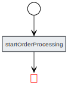
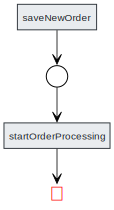
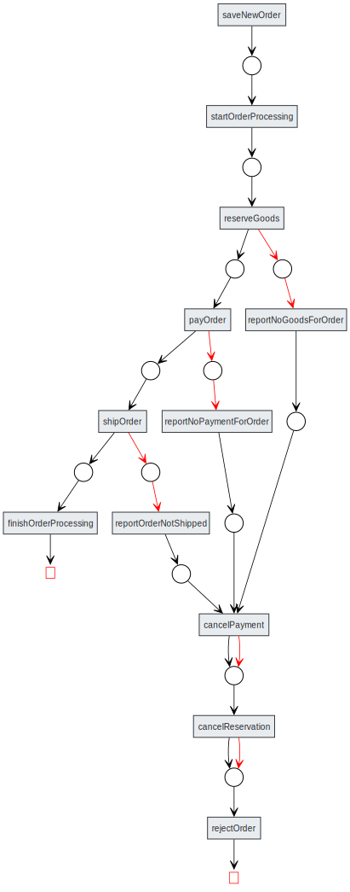

# Doer Tutorial

In this tutorial, we will create an application that interacts with two external
services, `Warehouse` and `Bank`, to process orders reliably using the Doer library.

Clone this tutorial.
```sh
git clone git@github.com:doer-lib/doertutorial.git
cd doertutorial
git log --oneline
```

Output should be like this (with different hashes):
```text
# git log --oneline        
0000000 (HEAD -> main, origin/main, origin/HEAD) Chapter 8. Exception Details
0000000 Chapter 7. Optimising Integration Test Speed
0000000 Chapter 6. Integration tests
0000000 Chapter 5. Unit Tests
0000000 Chapter 4. Implement OrderProcessor
0000000 Chapter 3. Creating and Managing Orders
0000000 Chapter 2. Add Doer configuration
0000000 Chapter 1. Create Quarkus project
0000000 Added README.md
4e8f66c Initial commit

```

## Demo Application

The application will:

1. **Reserve goods** (`reserveGoods`)
2. **Process payment** (`processPayment`)
3. **Ship the order** (`shipOrder`)

Additionally, the application must handle failures by:

1. **Retrying** if a call to an external service fails.
2. **Canceling the reservation** if payment fails.
3. **Canceling both payment and reservation** if shipping fails.

Multiple instances of the application should be able to run concurrently 
using shared database.

---

# 1. Create a Project

Any Java project can use the Doer library. In this tutorial, we will use **Quarkus**,
a fast and convenient framework.

## Creating a New Quarkus Application

Run the following command to generate a Quarkus project:

```sh
mvn io.quarkus:quarkus-maven-plugin:3.25.0:create \
    -DprojectGroupId=com.doertutorial \
    -DprojectArtifactId=doertutorial \
    -Dextensions=\
io.quarkus:quarkus-jdbc-postgresql,\
io.quarkus:quarkus-flyway,\
io.quarkus:quarkus-jsonp,\
io.quarkus:quarkus-resteasy-jsonb,\
io.quarkus:quarkus-resteasy-client-jsonb
```

Included Quarkus Extensions

- `quarkus-jdbc-postgresql` & `quarkus-flyway`: Used for database management (Tasks & Orders)
- `quarkus-jsonp`: Used to generate JSON messages
- `quarkus-resteasy-jsonb`: Facilitates REST endpoint creation
- `quarkus-resteasy-client-jsonb`: Enables REST client functionality

Navigate to the newly created project directory:

```sh
cd doertutorial
```

## Remove Example Code

```sh
rm src/main/java/com/doertutorial/GreetingResource.java
rm src/test/java/com/doertutorial/GreetingResourceTest.java
rm src/test/java/com/doertutorial/GreetingResourceIT.java
```


---

Next, we will implement the order processing logic using Doer annotations.

# 2. Add Doer Configuration

## 2.1 Dependency

Add the following dependency to your `pom.xml` file:

```xml
<dependency>
    <groupId>com.java-doer</groupId>
    <artifactId>doer</artifactId>
    <version>0.0.13</version>
</dependency>
```

Enable annotation processing for Java 23 and newer.

```xml
<properties>
    <compiler-plugin.version>3.14.0</compiler-plugin.version>
    <maven.compiler.release>21</maven.compiler.release>

    <!-- Enable annotation processing for Java 23 and newer -->
    <maven.compiler.proc>full</maven.compiler.proc>

    ...
</properties>
```

## 2.2 Scaffolding `OrderProcessor` Bean

Create the file `src/main/java/com/doertutorial/OrderProcessor.java` and add the following code:

```java
package com.doertutorial;

import com.doer.AcceptStatus;
import com.doer.Task;
import jakarta.enterprise.context.ApplicationScoped;

@ApplicationScoped
public class OrderProcessor {

    @AcceptStatus("New order created")
    public void startOrderProcessing(Task task) {
        task.setStatus(null);
    }
}
```

## 2.3 Configuring `DoerService`

To manage the lifecycle of `DoerService`, create `src/main/java/com/doertutorial/AppConfig.java`:

```java
package com.doertutorial;

import com.doer.DoerService;
import io.quarkus.logging.Log;
import io.quarkus.runtime.ShutdownEvent;
import io.quarkus.runtime.StartupEvent;
import jakarta.enterprise.event.Observes;
import jakarta.inject.Inject;

public class AppConfig {
    @Inject
    DoerService doerService;

    public void onApplicationStarted(@Observes StartupEvent startup) {
        Log.info("----- Starting Doer ----");
        doerService.start(true);
    }

    public void onApplicationShutdown(@Observes ShutdownEvent shutdown) {
        doerService.stop();
    }
}
```

## 2.4 Compile & Verify Generated Files

Compile the project:

```sh
mvn compile
```

List the generated source files:

```sh
ls target/generated-sources/annotations/com/doer/generated
ls -1 target/classes/com/doer/generated
```

You should see the following generated files:

```text
_GeneratedDoerService.java
CreateIndexes.sql
CreateSchema.sql
SelectTasks.sql
_GeneratedDoerService.class
doer.dot
doer.json
```

### Optionally: Visualize the Workflow Diagram

If you have `graphviz` installed, you can render the `doer.dot` file as an SVG:

```sh
dot -Tsvg < target/classes/com/doer/generated/doer.dot > diagram-chapter2.svg
```

View the generated diagram:



## 2.5 Database Migration

Enable Flyway migrations in `src/main/resources/application.properties`:

```properties
quarkus.flyway.migrate-at-start=true
```

Use the generated SQL files to create database migrations for the `tasks` and `task_logs` tables:

```sh
mkdir -p src/main/resources/db/migration

cp target/classes/com/doer/generated/CreateSchema.sql src/main/resources/db/migration/V2025.01.19.0__create_tasks_table.sql
cp target/classes/com/doer/generated/CreateIndexes.sql src/main/resources/db/migration/V2025.01.19.1__create_indexes_for_tasks.sql
```

## 2.6 Smoke Test

Build and start the application:

```sh
mvn package

mvn quarkus:dev
```

### Verify Flyway Migrations

Check the output logs to ensure Flyway migrations have been applied:

```text
2025-01-19 13:20:44,030 INFO  [org.fly.cor.FlywayExecutor] (main) Database: jdbc:postgresql://localhost:49400/quarkus?loggerLevel=OFF (PostgreSQL 17.2)
2025-01-19 13:20:44,067 INFO  [org.fly.cor.int.sch.JdbcTableSchemaHistory] (main) Schema history table "public"."flyway_schema_history" does not exist yet
2025-01-19 13:20:44,071 INFO  [org.fly.cor.int.com.DbValidate] (main) Successfully validated 2 migrations (execution time 00:00.015s)
2025-01-19 13:20:44,088 INFO  [org.fly.cor.int.sch.JdbcTableSchemaHistory] (main) Creating Schema History table "public"."flyway_schema_history" ...
2025-01-19 13:20:44,153 INFO  [org.fly.cor.int.com.DbMigrate] (main) Current version of schema "public": << Empty Schema >>
2025-01-19 13:20:44,162 INFO  [org.fly.cor.int.com.DbMigrate] (main) Migrating schema "public" to version "2025.01.19.0 - create tasks table"
2025-01-19 13:20:44,192 INFO  [org.fly.cor.int.com.DbMigrate] (main) Migrating schema "public" to version "2025.01.19.1 - create indexes for tasks"
2025-01-19 13:20:44,213 INFO  [org.fly.cor.int.com.DbMigrate] (main) Successfully applied 2 migrations to schema "public", now at version v2025.01.19.1 (execution time 00:00.018s)
```

### Verify `DoerService` Startup

Ensure that `DoerService` has started successfully:

```text
2025-01-19 13:20:44,235 INFO  [com.dem.AppConfig] (main) ----- starting doer ----
2025-01-19 13:20:44,277 INFO  [com.doe.DoerService] (executor-thread-1) Load tasks.size: 0
2025-01-19 13:20:44,277 INFO  [com.doe.DoerService] (executor-thread-1) Loaded in_progress: 0
2025-01-19 13:20:44,277 INFO  [com.doe.DoerService] (executor-thread-1) Limits: [10, 10]
2025-01-19 13:20:44,277 INFO  [com.doe.DoerService] (executor-thread-1) Loads: [0, 0]
2025-01-19 13:20:44,278 INFO  [com.doe.DoerService] (executor-thread-1) Tasks to reload later: []
2025-01-19 13:20:44,278 INFO  [com.doe.DoerService] (executor-thread-1) Queues Loaded (limit/loaded): 10/0, 10/0
2025-01-19 13:20:44,280 INFO  [com.doe.DoerService] (doer-idle-monitor) Next check after 60000

```

# 3. Creating and Managing Orders

In this tutorial, our application interacts with external `Warehouse` and `Bank` services to process orders.

Processing may fail.
The order's state is updated accordingly:
- **`SHIPPED`** if the process completes successfully.
- **`REJECTED`** if any failure cannot be recovered.

---

## 3.1 Database Schema and DAO

We'll define an `orders` table and implement basic DAO operations.

### Creating the Orders Table

Create the migration file: `src/main/resources/db/migration/V2025.01.19.3__create_orders_table.sql`

```sql
CREATE TABLE orders
(
    id UUID PRIMARY KEY,
    created TIMESTAMP WITH TIME ZONE,
    modified TIMESTAMP WITH TIME ZONE,
    task_id BIGINT,
    status VARCHAR,
    json_data JSONB
);

CREATE INDEX ndx_orders_task_id ON orders (task_id);
CREATE INDEX ndx_orders_json_data ON orders USING gin(json_data);
```

### Defining Order Status

Create `src/main/java/com/doertutorial/OrderStatus.java`:

```java
package com.doertutorial;

public enum OrderStatus {
    NEW,
    PROCESSING,
    SHIPPED,
    REJECTED,
}
```

### Order Entity

Create `src/main/java/com/doertutorial/Order.java`:

```java
package com.doertutorial;

import java.time.Instant;
import java.util.UUID;

public class Order {
    private UUID id;
    private Instant created;
    private Instant modified;
    private OrderStatus status;
    private Long taskId;
    private String customer;
    private String items;
    private String rejectReason;
    private String reservationToken;
    private String paymentTransactionId;
    private String deliveryTrackingId;

    public void assignFieldsFrom(Order other) {
        id = other.id;
        created = other.created;
        modified = other.modified;
        status = other.status;
        taskId = other.taskId;
        customer = other.customer;
        items = other.items;
        rejectReason = other.rejectReason;
        reservationToken = other.reservationToken;
        paymentTransactionId = other.paymentTransactionId;
        deliveryTrackingId = other.deliveryTrackingId;
    }

    public UUID getId() {
        return id;
    }

    public void setId(UUID id) {
        this.id = id;
    }

    public Instant getCreated() {
        return created;
    }

    public void setCreated(Instant created) {
        this.created = created;
    }

    public Instant getModified() {
        return modified;
    }

    public void setModified(Instant modified) {
        this.modified = modified;
    }

    public OrderStatus getStatus() {
        return status;
    }

    public void setStatus(OrderStatus status) {
        this.status = status;
    }

    public Long getTaskId() {
        return taskId;
    }

    public void setTaskId(Long taskId) {
        this.taskId = taskId;
    }

    public String getCustomer() {
        return customer;
    }

    public void setCustomer(String customer) {
        this.customer = customer;
    }

    public String getItems() {
        return items;
    }

    public void setItems(String items) {
        this.items = items;
    }

    public String getRejectReason() {
        return rejectReason;
    }

    public void setRejectReason(String rejectReason) {
        this.rejectReason = rejectReason;
    }

    public String getReservationToken() {
        return reservationToken;
    }

    public void setReservationToken(String reservationToken) {
        this.reservationToken = reservationToken;
    }

    public String getPaymentTransactionId() {
        return paymentTransactionId;
    }

    public void setPaymentTransactionId(String paymentTransactionId) {
        this.paymentTransactionId = paymentTransactionId;
    }

    public String getDeliveryTrackingId() {
        return deliveryTrackingId;
    }

    public void setDeliveryTrackingId(String deliveryTrackingId) {
        this.deliveryTrackingId = deliveryTrackingId;
    }
}

```

### Order DAO

Create `src/main/java/com/doertutorial/OrderDao.java`:

```java
package com.doertutorial;

import io.quarkus.logging.Log;
import jakarta.enterprise.context.ApplicationScoped;
import jakarta.inject.Inject;
import jakarta.json.*;
import jakarta.transaction.Transactional;

import javax.sql.DataSource;
import java.io.StringReader;
import java.sql.*;
import java.time.Instant;
import java.time.OffsetDateTime;
import java.util.UUID;

@ApplicationScoped
@Transactional
public class OrderDao {
    @Inject
    DataSource ds;

    public void insertOrder(Order order) throws SQLException {
        String sql = "INSERT INTO orders (id, created, modified, task_id, status, json_data) " +
            "VALUES (?, now(), now(), ?, ?, ?::JSONB) " +
            "RETURNING *";
        try (Connection con = ds.getConnection(); PreparedStatement pst = con.prepareStatement(sql)) {
            UUID id = order.getId() != null ? order.getId() : UUID.randomUUID();
            pst.setObject(1, id);
            if (order.getTaskId() != null) {
                pst.setLong(2, order.getTaskId());
            } else {
                pst.setNull(2, Types.BIGINT);
            }
            pst.setString(3, order.getStatus() == null ? null : order.getStatus().name());
            pst.setString(4, createJsonData(order));
            try (ResultSet rs = pst.executeQuery()) {
                if (rs.next()) {
                    order.assignFieldsFrom(readOrder(rs));
                } else {
                    throw new IllegalStateException("INSERT ... RETURNING * call failed");
                }
            }
        }
    }

    public void updateOrder(Order order) throws SQLException {
        String sql = "UPDATE orders SET modified = now(), task_id = ?, status = ?, json_data = ?::JSONB " +
            "WHERE id = ? " +
            "RETURNING *";
        try (Connection con = ds.getConnection(); PreparedStatement pst = con.prepareStatement(sql)) {
            pst.setLong(1, order.getTaskId());
            pst.setString(2, order.getStatus() == null ? null : order.getStatus().name());
            pst.setString(3, createJsonData(order));
            pst.setObject(4, order.getId());
            try (ResultSet rs = pst.executeQuery()) {
                if (rs.next()) {
                    order.assignFieldsFrom(readOrder(rs));
                } else {
                    throw new IllegalStateException("Order not found in database");
                }
            }
        }
    }

    public Order findOrderById(UUID id) throws SQLException {
        String sql = "SELECT * FROM orders WHERE id = ?";
        try (Connection con = ds.getConnection(); PreparedStatement pst = con.prepareStatement(sql)) {
            pst.setObject(1, id);
            try (ResultSet rs = pst.executeQuery()) {
                if (rs.next()) {
                    return readOrder(rs);
                }
                return null;
            }
        }
    }

    public Order findOrderByTaskId(long taskId) throws SQLException {
        String sql = "SELECT * FROM orders WHERE task_id = ? ORDER BY id LIMIT 1";
        try (Connection con = ds.getConnection(); PreparedStatement pst = con.prepareStatement(sql)) {
            pst.setObject(1, taskId);
            try (ResultSet rs = pst.executeQuery()) {
                if (rs.next()) {
                    return readOrder(rs);
                }
                return null;
            }
        }
    }

    static Order readOrder(ResultSet rs) throws SQLException {
        Order order = new Order();
        order.setId(rs.getObject("id", UUID.class));
        order.setCreated(odtToInstant(rs.getObject("created", OffsetDateTime.class)));
        order.setModified(odtToInstant(rs.getObject("modified", OffsetDateTime.class)));
        order.setTaskId(readNullableLong(rs, "task_id"));
        order.setStatus(safeReadOrderStatus(rs, "status"));
        updateOrderFromJsonData(order, rs.getString("json_data"));
        return order;
    }

    static Long readNullableLong(ResultSet rs, String column) throws SQLException {
        long result = rs.getLong(column);
        return rs.wasNull() ? null : result;
    }

    static OrderStatus safeReadOrderStatus(ResultSet rs, String column) throws SQLException {
        String string = rs.getString(column);
        try {
            return OrderStatus.valueOf(string);
        } catch (IllegalArgumentException e) {
            Log.warn("Failed to parse OrderStatus " + string + ". Setting null instead.");
            return null;
        }
    }

    static Instant odtToInstant(OffsetDateTime dateTime) {
        return dateTime == null ? null : dateTime.toInstant();
    }

    static String createJsonData(Order order) {
        if (order == null) {
            return null;
        }
        JsonObjectBuilder b = Json.createObjectBuilder();
        if (order.getCustomer() != null) {
            b.add("customer", order.getCustomer());
        }
        if (order.getItems() != null) {
            b.add("items", order.getItems());
        }
        if (order.getRejectReason() != null) {
            b.add("reject_reason", order.getRejectReason());
        }
        if (order.getReservationToken() != null) {
            b.add("reservation_token", order.getReservationToken());
        }
        if (order.getPaymentTransactionId() != null) {
            b.add("payment_transaction_id", order.getPaymentTransactionId());
        }
        if (order.getDeliveryTrackingId() != null) {
            b.add("delivery_tracking_id", order.getDeliveryTrackingId());
        }
        return b.build().toString();
    }

    static void updateOrderFromJsonData(Order order, String jsonData) {
        if (jsonData == null) {
            return;
        }
        JsonObject json = Json.createReader(new StringReader(jsonData)).readObject();
        order.setCustomer(json.getString("customer", null));
        order.setItems(json.getString("items", null));
        order.setRejectReason(json.getString("reject_reason", null));
        order.setReservationToken(json.getString("reservation_token", null));
        order.setPaymentTransactionId(json.getString("payment_transaction_id", null));
        order.setDeliveryTrackingId(json.getString("delivery_tracking_id", null));
    }
}

```

---

## 3.2 REST Clients for External Services

### Warehouse Service Client

Create `src/main/java/com/doertutorial/Warehouse.java`:

```java
package com.doertutorial;

import jakarta.ws.rs.Consumes;
import jakarta.ws.rs.POST;
import jakarta.ws.rs.Path;
import jakarta.ws.rs.Produces;
import jakarta.ws.rs.core.MediaType;
import org.eclipse.microprofile.rest.client.inject.RegisterRestClient;

@RegisterRestClient(configKey = "warehouse")
@Consumes(MediaType.APPLICATION_JSON)
@Produces(MediaType.APPLICATION_JSON)
public interface Warehouse {

    @POST
    @Path("warehouse/reserve")
    Reservation reserveGoods(Order order);

    @POST
    @Path("warehouse/ship")
    TrackId shipTheOrder(Order order);

    @POST
    @Path("warehouse/cancel")
    void cancelReservation(Reservation reservation);

    record Reservation(String token) {
    }

    record TrackId(String token) {
    }
}

```

### Bank Service Client

Create `src/main/java/com/doertutorial/Bank.java`:

```java
package com.doertutorial;

import jakarta.ws.rs.*;
import jakarta.ws.rs.core.MediaType;
import org.eclipse.microprofile.rest.client.inject.RegisterRestClient;

@RegisterRestClient(configKey = "bankapi")
@Consumes(MediaType.APPLICATION_JSON)
@Produces(MediaType.APPLICATION_JSON)
public interface Bank {
    @POST
    @Path("bank/processPayment")
    Check processPayment(Order order);

    @POST
    @Path("bank/cancelPayment")
    void cancelPayment(Check check);

    record Check(String transactionId) {
    }
}
```

### Configuring REST Clients

Update `src/main/resources/application.properties`:

```properties
quarkus.flyway.migrate-at-start=true
quarkus.rest-client.warehouse.url=http://localhost:8085/
quarkus.rest-client.bankapi.url=http://localhost:8085/
```

---

## 3.3 Frontend and REST API

### HTML Form for Creating Orders

Create `src/main/resources/META-INF/resources/index.html`:

```html
<!DOCTYPE html>
<html lang="en">
<head>
    <title>Doer Tutorial</title>
</head>
<body>
<form action="orders/submit" method="post">
    <label>Customer: <input type="text" name="customer"></label>
    <label>Items: <input type="text" name="items"></label>
    <input type="submit" value="Add order">
</form>
</body>
</html>
```

### Order Creation API

Create `src/main/java/com/doertutorial/OrdersResource.java`:

```java
package com.doertutorial;

import com.doer.DoerService;
import com.doer.Task;
import io.quarkus.logging.Log;
import jakarta.inject.Inject;
import jakarta.json.bind.Jsonb;
import jakarta.json.bind.JsonbBuilder;
import jakarta.json.bind.JsonbConfig;
import jakarta.json.bind.config.PropertyOrderStrategy;
import jakarta.ws.rs.*;
import jakarta.ws.rs.core.MediaType;
import jakarta.ws.rs.core.Response;

import java.net.URI;
import java.sql.SQLException;
import java.util.HashMap;
import java.util.Map;
import java.util.UUID;

@Path("orders")
public class OrdersResource {
    @Inject
    OrderDao orderDao;
    @Inject
    DoerService doerService;
    @Inject
    OrderProcessor orderProcessor;

    @POST
    @Path("submit")
    public Response submitNewOrder(
            @FormParam("customer") String customer,
            @FormParam("items") String items) throws SQLException {
        Order order = new Order();
        order.setCustomer(customer);
        order.setItems(items);
        orderProcessor.saveNewOrder(order);
        doerService.triggerTaskReloadFromDb(order.getTaskId());
        Log.infof("Order submitted: %s", order.getId());
        return Response.seeOther(URI.create("/orders/" + order.getId()))
                .build();
    }

    @GET
    @Path("{id}")
    @Produces(MediaType.APPLICATION_JSON)
    public Response getOrder(@PathParam("id") UUID id) throws Exception {
        // Custom json rendering (for debugging purpose)
        JsonbConfig jsonbConfig = new JsonbConfig()
                .withFormatting(true)
                .withNullValues(true)
                .withPropertyOrderStrategy(PropertyOrderStrategy.LEXICOGRAPHICAL);
        try (Jsonb jsonb = JsonbBuilder.create(jsonbConfig)) {
            Order order = orderDao.findOrderById(id);
            if (order == null) {
                throw new NotFoundException("Order not found");
            }
            Task task = (order.getTaskId() != null ? doerService.loadTask(order.getTaskId()) : null);
            Map<String, Object> map = new HashMap<>();
            map.put("order", order);
            map.put("task", task);
            String json = jsonb.toJson(map);
            return Response.ok(json, MediaType.APPLICATION_JSON_TYPE)
                    .build();
        }
    }
}
```

---

## 3.4 Saving new Order

Update `src/main/java/com/doertutorial/OrderProcessor.java`:

```java
package com.doertutorial;

import com.doer.AcceptStatus;
import com.doer.DoerService;
import com.doer.Task;
import jakarta.enterprise.context.ApplicationScoped;
import jakarta.inject.Inject;
import jakarta.transaction.Transactional;

import java.sql.SQLException;

@ApplicationScoped
public class OrderProcessor {
    public static final String NEW_ORDER_CREATED = "New order created";

    @Inject
    DoerService doerService;
    @Inject
    OrderDao orderDao;

    @Transactional
    public void saveNewOrder(Order order) throws SQLException {
        Task task = new Task();
        task.setStatus(NEW_ORDER_CREATED);
        doerService.insert(task);
        order.setTaskId(task.getId());
        order.setStatus(OrderStatus.NEW);
        orderDao.insertOrder(order);
    }

    @AcceptStatus(NEW_ORDER_CREATED)
    public void startOrderProcessing(Task task) {
        task.setStatus(null);
    }
}
```

After compilation, you can generate updated diagram:

```sh
mvn clean compile

dot -Tsvg < target/classes/com/doer/generated/doer.dot > diagram-chapter3.svg

```



---

## 3.5 Running a Smoke Test

Start Quarkus in development mode:

```sh
mvn quarkus:dev
```

Open [http://localhost:8080](http://localhost:8080) and submit the form.

### Example JSON Response

```json
{
  "order": {
    "customer": "alice",
    "deliveryTrackingId": null,
    "id": "d9bb8f7e-3354-4aab-ad91-bb1bf309e326",
    "items": "pen",
    "paymentTransactionId": null,
    "rejectReason": null,
    "reservationToken": null,
    "status": "NEW",
    "taskId": 1002
  },
  "task": {
    "created": "2025-01-29T10:24:38.146124Z",
    "failingSince": null,
    "id": 1002,
    "inProgress": false,
    "modified": "2025-01-29T10:24:38.157233Z",
    "status": null,
    "version": 2
  }
}
```

This confirms that the order was created successfully and is ready for processing.

# 4. Implement OrderProcessor

## 4.1 OrderProcessor

The `OrderProcessor` is responsible for handling the end-to-end processing of
an order, ensuring it transitions smoothly through various statuses.
It interacts with external services (**Warehouse** and **Bank**) and utilizes
Doer to manage task statuses and retries.

Update `src/main/java/com/doertutorial/OrderProcessor.java`:

```java
package com.doertutorial;

import com.doer.*;
import com.doertutorial.Bank.Check;
import com.doertutorial.Warehouse.Reservation;
import com.doertutorial.Warehouse.TrackId;
import io.quarkus.logging.Log;
import jakarta.enterprise.context.ApplicationScoped;
import jakarta.inject.Inject;
import jakarta.transaction.Transactional;
import org.eclipse.microprofile.rest.client.inject.RestClient;

import java.sql.SQLException;

@ApplicationScoped
public class OrderProcessor {
    public static final String NEW_ORDER_CREATED = "New order created";
    public static final String ORDER_PROCESSING_STARTED = "Order processing started";
    public static final String GOODS_RESERVED = "Goods reserved";
    public static final String NO_GOODS = "No Goods";
    public static final String REJECTED_NO_GOODS = "Rejected No Goods";
    public static final String PAYMENT_FAILED = "Payment failed";
    public static final String ORDER_PAID = "Order paid";
    public static final String REJECTED_NO_PAYMENT = "Rejected No Payment";
    public static final String ORDER_NOT_SHIPPED = "Order Not shipped";
    public static final String ORDER_SHIPPED = "Order shipped";
    public static final String REJECTED_NO_SHIPPING = "Rejected No Shipping";
    public static final String PAYMENT_CANCELLED = "Payment cancelled";
    public static final String RESERVATION_CANCELLED = "Reservation cancelled";

    @Inject
    DoerService doerService;
    @Inject
    OrderDao orderDao;
    @Inject
    @RestClient
    Warehouse warehouse;
    @Inject
    @RestClient
    Bank bank;

    @Transactional
    public void saveNewOrder(Order order) throws SQLException {
        Task task = new Task();
        task.setStatus(NEW_ORDER_CREATED);
        doerService.insert(task);
        order.setTaskId(task.getId());
        order.setStatus(OrderStatus.NEW);
        orderDao.insertOrder(order);
    }

    @AcceptStatus(NEW_ORDER_CREATED)
    public void startOrderProcessing(Task task, Order order) {
        order.setStatus(OrderStatus.PROCESSING);
        task.setStatus(ORDER_PROCESSING_STARTED);
    }

    @AcceptStatus(ORDER_PROCESSING_STARTED)
    @OnException(retry = "every 5s during 5s", setStatus = NO_GOODS)
    public void reserveGoods(Task task, Order order) {
        Reservation reservation = warehouse.reserveGoods(order);
        order.setReservationToken(reservation.token());
        task.setStatus(GOODS_RESERVED);
    }

    @AcceptStatus(NO_GOODS)
    public void reportNoGoodsForOrder(Task task, Order order) {
        order.setRejectReason("Cannot reserve goods for this order.");
        task.setStatus(REJECTED_NO_GOODS);
    }

    @AcceptStatus(GOODS_RESERVED)
    @OnException(retry = "every 5s during 10s", setStatus = PAYMENT_FAILED)
    public void payOrder(Task task, Order order) {
        Check check = bank.processPayment(order);
        order.setPaymentTransactionId(check.transactionId());
        task.setStatus(ORDER_PAID);
    }

    @AcceptStatus(PAYMENT_FAILED)
    public void reportNoPaymentForOrder(Task task, Order order) {
        order.setRejectReason("Payment not processed.");
        task.setStatus(REJECTED_NO_PAYMENT);
    }

    @AcceptStatus(ORDER_PAID)
    @OnException(retry = "every 5s during 5s", setStatus = ORDER_NOT_SHIPPED)
    public void shipOrder(Task task, Order order) {
        TrackId trackId = warehouse.shipTheOrder(order);
        order.setDeliveryTrackingId(trackId.token());
        task.setStatus(ORDER_SHIPPED);
    }

    @AcceptStatus(ORDER_NOT_SHIPPED)
    public void reportOrderNotShipped(Task task, Order order) {
        order.setRejectReason("Unable to ship the order.");
        task.setStatus(REJECTED_NO_SHIPPING);
    }

    @AcceptStatus(ORDER_SHIPPED)
    public void finishOrderProcessing(Task task, Order order) {
        Log.infof("Order shipped %s", order.getId());
        order.setStatus(OrderStatus.SHIPPED);
        task.setStatus(null);
    }

    @AcceptStatus(REJECTED_NO_GOODS)
    @AcceptStatus(REJECTED_NO_PAYMENT)
    @AcceptStatus(REJECTED_NO_SHIPPING)
    @OnException(retry = "every 5s during 10s", setStatus = PAYMENT_CANCELLED)
    public void cancelPayment(Task task, Order order) {
        if (order.getPaymentTransactionId() != null) {
            Check check = new Check(order.getPaymentTransactionId());
            bank.cancelPayment(check);
        }
        task.setStatus(PAYMENT_CANCELLED);
    }

    @AcceptStatus(PAYMENT_CANCELLED)
    @OnException(retry = "every 5s during 10s", setStatus = RESERVATION_CANCELLED)
    public void cancelReservation(Task task, Order order) {
        if (order.getReservationToken() != null) {
            Reservation reservation = new Reservation(order.getReservationToken());
            warehouse.cancelReservation(reservation);
        }
        task.setStatus(RESERVATION_CANCELLED);
    }

    @AcceptStatus(RESERVATION_CANCELLED)
    public void rejectOrder(Task task, Order order) {
        order.setStatus(OrderStatus.REJECTED);
        task.setStatus(null);
    }
}
```

## 4.2 OrderDao

To enable Doer to pass `Order` to `@AcceptStatus` annotated methods, we must
provide **Load** and **Save** operations:

Add to `src/main/java/com/doertutorial/OrderDao.java` this 2 methods:

```java
    @DoerLoader
    public Order loadOrderForTask(Task task) throws SQLException {
        return findOrderByTaskId(task.getId());
    }

    @DoerUnloader
    public void saveOrder(Task task, Order order) throws SQLException {
        updateOrder(order);
    }
```

## 4.3 Doer Diagram

On every build, Doer generates a `doer.dot` file that represents the workflow. You can visualize it using Graphviz:

```shell
mvn clean compile

dot -Tsvg < target/classes/com/doer/generated/doer.dot > diagram-chapter4.svg
```

The `doer.dot` file is automatically updated, so re-render it after changes.

`diagram-chapter4.svg`




## 4.4 Wiremock Mappings

To test interactions with external services, configure **Wiremock mappings**.

### Warehouse API Mock

Add `src/test/resources/wiremock/mappings/warehouse.json`:

```json
{
  "mappings": [
    {
      "request": {
        "method": "POST",
        "url": "/warehouse/reserve"
      },
      "response": {
        "status": 200,
        "jsonBody": {
          "token": "mocked-token"
        },
        "headers": {
          "Content-Type": "application/json"
        }
      }
    },
    {
      "request": {
        "method": "POST",
        "url": "/warehouse/ship"
      },
      "response": {
        "status": 200,
        "jsonBody": {
          "token": "mocked-shipping-token"
        },
        "headers": {
          "Content-Type": "application/json"
        }
      }
    },
    {
      "request": {
        "method": "POST",
        "url": "/warehouse/cancel"
      },
      "response": {
        "status": 204,
        "body": ""
      }
    }
  ]
}
```

### Bank API Mock

Add `src/test/resources/wiremock/mappings/bank.json`:

```json
{
  "mappings": [
    {
      "request": {
        "method": "POST",
        "url": "/bank/processPayment"
      },
      "response": {
        "status": 200,
        "jsonBody": {
          "transactionId": "mocked-transactionId"
        },
        "headers": {
          "Content-Type": "application/json"
        }
      }
    },
    {
      "request": {
        "method": "POST",
        "url": "/bank/cancelPayment"
      },
      "response": {
        "status": 204,
        "body": ""
      }
    }
  ]
}
```

## 4.5 Running and Testing

Rebuild and start the Quarkus application:

```shell
mvn clean compile quarkus:dev
```

Start **Wiremock** in another terminal:

```shell
docker run -it --rm \
  -p 8085:8080 \
  --name wiremock \
  -v $PWD/src/test/resources/wiremock:/home/wiremock \
  wiremock/wiremock:3.10.0
```

### Submit an Order

In your browser, create an order and observe its status transition from `NEW` → `PROCESSING` → `SHIPPED`.

```json
{
  "order": {
    "customer": "alice",
    "deliveryTrackingId": "mocked-shipping-token",
    "id": "80564cd3-696c-4781-9d58-a0eb2ea40452",
    "items": "pen",
    "paymentTransactionId": "mocked-transactionId",
    "rejectReason": null,
    "reservationToken": "mocked-token",
    "status": "SHIPPED",
    "taskId": 1016
  },
  "task": {
    "created": "2025-01-29T11:25:32.151985Z",
    "failingSince": null,
    "id": 1016,
    "inProgress": false,
    "modified": "2025-01-29T11:25:32.372520Z",
    "status": null,
    "version": 10
  }
}
```

Querying the database will show the task execution logs:

```text
quarkus=# select * from task_logs where task_id = 1016 order by created;
  id  | task_id |            created            |      initial_status      |       final_status       |   class_name   |      method_name      | duration_ms | exception_type | extra_json
------+---------+-------------------------------+--------------------------+--------------------------+----------------+-----------------------+-------------+----------------+------------
 1017 |    1016 | 2025-01-29 11:25:32.164308+00 | New order created        | Order processing started | OrderProcessor | startOrderProcessing  |           9 |                |
 1018 |    1016 | 2025-01-29 11:25:32.325344+00 | Order processing started | Goods reserved           | OrderProcessor | reserveGoods          |         158 |                |
 1019 |    1016 | 2025-01-29 11:25:32.345493+00 | Goods reserved           | Order paid               | OrderProcessor | payOrder              |          18 |                |
 1020 |    1016 | 2025-01-29 11:25:32.36117+00  | Order paid               | Order shipped            | OrderProcessor | shipOrder             |          13 |                |
 1021 |    1016 | 2025-01-29 11:25:32.37252+00  | Order shipped            |                          | OrderProcessor | finishOrderProcessing |           8 |                |
(5 rows)

```

Now, your order processing system is fault-tolerant and fully operational!

# 5. Unit Tests

Add the following dependency to your `pom.xml` file:

```xml
<dependency>
    <groupId>org.mockito</groupId>
    <artifactId>mockito-core</artifactId>
    <scope>test</scope>
</dependency>
<dependency>
    <groupId>org.mockito</groupId>
    <artifactId>mockito-junit-jupiter</artifactId>
    <scope>test</scope>
</dependency>
```

## 5.1 Accessing Task's Protected Methods

Since `com.doer.Task` has protected methods, we need a helper class to modify its internal state during testing.

### Add `DoerAccessor` Class

Create a new file `src/test/java/com/doer/DoerAccessor.java`:

```java
package com.doer;

public class DoerAccessor {
    public static void assignTaskId(Task task, Long id) {
        task.setId(id);
    }
}
```

This utility class allows setting a task ID, which is needed for unit tests.

## 5.2 Unit Testing `OrderProcessor`

To test `OrderProcessor`, we will use Mockito for dependency injection and method verification.

### Add `OrderProcessorTest`

Create a new file `src/test/java/com/doertutorial/OrderProcessorTest.java`:

```java
package com.doertutorial;

import com.doer.DoerAccessor;
import com.doer.DoerService;
import com.doer.Task;
import com.doertutorial.Bank.Check;
import com.doertutorial.Warehouse.Reservation;
import com.doertutorial.Warehouse.TrackId;
import org.junit.jupiter.api.BeforeEach;
import org.junit.jupiter.api.Test;
import org.junit.jupiter.api.extension.ExtendWith;
import org.mockito.InjectMocks;
import org.mockito.Mock;
import org.mockito.junit.jupiter.MockitoExtension;

import static com.doertutorial.OrderProcessor.*;
import static org.junit.jupiter.api.Assertions.assertEquals;
import static org.junit.jupiter.api.Assertions.assertNull;
import static org.mockito.ArgumentMatchers.any;
import static org.mockito.ArgumentMatchers.eq;
import static org.mockito.Mockito.doAnswer;
import static org.mockito.Mockito.verify;
import static org.mockito.Mockito.verifyNoInteractions;
import static org.mockito.Mockito.when;

@ExtendWith(MockitoExtension.class)
class OrderProcessorTest {

    @Mock
    DoerService doerService;
    @Mock
    OrderDao orderDao;
    @Mock
    Warehouse warehouse;
    @Mock
    Bank bank;

    @InjectMocks
    OrderProcessor orderProcessor;

    Task task;
    Order order;

    @BeforeEach
    void init() {
        task = new Task();
        DoerAccessor.assignTaskId(task, 17L);
        task.setStatus("Test status");
        order = new Order();
    }

    @Test
    void saveNewOrder__should_create_task() throws Exception {
        doAnswer(i -> {
            task = i.getArgument(0);
            DoerAccessor.assignTaskId(task, 720L);
            return null;
        }).when(doerService).insert(any(Task.class));

        orderProcessor.saveNewOrder(order);

        assertEquals(720L, order.getTaskId());
        assertEquals(OrderStatus.NEW, order.getStatus());
        verify(orderDao).insertOrder(order);
        assertEquals(NEW_ORDER_CREATED, task.getStatus());
    }

    @Test
    void startOrderProcessing__should_update_order_status() {
        orderProcessor.startOrderProcessing(task, order);

        assertEquals(OrderStatus.PROCESSING, order.getStatus());
        assertEquals(ORDER_PROCESSING_STARTED, task.getStatus());
    }

    @Test
    void reserveGoods__should_store_reservation_token() {
        when(warehouse.reserveGoods(order))
                .thenReturn(new Reservation("test-reservation-token"));

        orderProcessor.reserveGoods(task, order);

        assertEquals("test-reservation-token", order.getReservationToken());
        assertEquals(GOODS_RESERVED, task.getStatus());
    }

    @Test
    void reportNoGoodsForOrder__should_update_reject_reason() {
        orderProcessor.reportNoGoodsForOrder(task, order);

        assertEquals("Cannot reserve goods for this order.", order.getRejectReason());
        assertEquals(REJECTED_NO_GOODS, task.getStatus());
    }

    @Test
    void payOrder__should_store_transaction_id() {
        when(bank.processPayment(order))
                .thenReturn(new Check("test-transaction-id"));

        orderProcessor.payOrder(task, order);

        assertEquals("test-transaction-id", order.getPaymentTransactionId());
        assertEquals(ORDER_PAID, task.getStatus());
    }

    @Test
    void reportNoPaymentForOrder__should_update_reject_reason() {

        orderProcessor.reportNoPaymentForOrder(task, order);

        assertEquals("Payment not processed.", order.getRejectReason());
        assertEquals(REJECTED_NO_PAYMENT, task.getStatus());
    }

    @Test
    void shipOrder__should_save_tracking_id() {
        when(warehouse.shipTheOrder(order))
                .thenReturn(new TrackId("test-tracking-number"));

        orderProcessor.shipOrder(task, order);

        assertEquals("test-tracking-number", order.getDeliveryTrackingId());
        assertEquals(ORDER_SHIPPED, task.getStatus());
    }

    @Test
    void reportOrderNotShipped__should_update_reject_reason() {
        orderProcessor.reportOrderNotShipped(task, order);

        assertEquals("Unable to ship the order.", order.getRejectReason());
        assertEquals(REJECTED_NO_SHIPPING, task.getStatus());
    }

    @Test
    void finishOrderProcessing__should_update_order_status() {
        orderProcessor.finishOrderProcessing(task, order);

        assertEquals(OrderStatus.SHIPPED, order.getStatus());
        assertNull(task.getStatus());
    }

    @Test
    void cancelPayment__should_call_bank() {
        order.setPaymentTransactionId("test-id1");

        orderProcessor.cancelPayment(task, order);

        verify(bank).cancelPayment(eq(new Check("test-id1")));
        assertEquals(PAYMENT_CANCELLED, task.getStatus());
    }

    @Test
    void cancelPayment__should_skip_calling_bank() {
        order.setPaymentTransactionId(null);

        orderProcessor.cancelPayment(task, order);

        assertEquals(PAYMENT_CANCELLED, task.getStatus());
        verifyNoInteractions(bank);
    }

    @Test
    void cancelReservation__should_call_warehouse() {
        order.setReservationToken("test-token-7");

        orderProcessor.cancelReservation(task, order);

        verify(warehouse).cancelReservation(eq(new Reservation("test-token-7")));
        assertEquals(RESERVATION_CANCELLED, task.getStatus());
    }

    @Test
    void cancelReservation__should_skip_calling_warehouse() {
        order.setReservationToken(null);

        orderProcessor.cancelReservation(task, order);

        assertEquals(RESERVATION_CANCELLED, task.getStatus());
        verifyNoInteractions(warehouse);
    }

    @Test
    void rejectOrder__should_update_order_status() {
        orderProcessor.rejectOrder(task, order);

        assertEquals(OrderStatus.REJECTED, order.getStatus());
        assertNull(task.getStatus());
    }
}
```

Rebuild and run tests:

```sh
mvn clean package
```

## 5.3 Test Coverage and Next Steps

These unit tests achieve **100% line and branch coverage** for `OrderProcessor` class.
However, they only verify isolated steps.
To validate complete order processing logic, integration tests are required.

---

# 6. Integration tests

In this chapter, we will validate the order processing algorithm defined using
the `@AcceptStatus` and `@OnException` annotations. To do this, we need to run
the application in a controlled environment where external services (such as
`Warehouse` and `Bank`) can be simulated, and the full application context is
available for testing.

### Maven tips:

* The `maven-surefire-plugin` is used to run unit tests (`*Test.java`) before assembling
  the JAR file. You can execute it with `mvn test` or `mvn package` (which also assembles
  the JAR).
* The `maven-failsafe-plugin` runs integration tests (`*ITCase.java` or `*IT.java`) after
  the JAR is built. You can execute it with `mvn verify` or `mvn install`.

### Testing Key Scenarios:

In integration tests, we typically focus on validating the most important paths, including:

* **Success Path:** Ensure that when an order is processed successfully (reservation, payment,
  shipping), the customer is billed, and the order is shipped.
* **Business Logic Validation:** Ensure that when something goes wrong (e.g., a payment
  failure or shipping issue), the application properly handles compensation (e.g., refunding
  the payment if goods weren’t shipped).
* **Error Scenarios:** Test for edge cases such as timeouts, system crashes, or unexpected
  failures, ensuring the system behaves as expected.

## 6.1 Dependencies

First remove `skipITs` property declaration in pom.xml
```xml
<!-- Find and delete in pom.xml this line: -->
<skipITs>true</skipITs>
```

### Add WireMock dependency:

Add the following dependency to your `pom.xml` file:

```xml
<dependency>
    <groupId>org.wiremock</groupId>
    <artifactId>wiremock</artifactId>
    <version>3.10.0</version>
    <scope>test</scope>
</dependency>
```

## 6.2 Testbed

For the integration tests, we’ll need to start a controlled environment, including Docker containers
for PostgreSQL and WireMock, along with the application itself running as a Java process. We will use
a custom class, Testbed, to manage the setup and teardown of the test environment.

### Testbed Setup

Add `src/test/java/it/Testbed.java` to your project:

```java
package it;

import com.github.tomakehurst.wiremock.client.WireMock;
import io.restassured.RestAssured;

import java.io.BufferedReader;
import java.io.File;
import java.io.IOException;
import java.nio.file.Files;
import java.sql.Connection;
import java.sql.DriverManager;
import java.sql.SQLException;
import java.time.Duration;
import java.time.Instant;
import java.util.Map;
import java.util.function.Function;
import java.util.function.Supplier;

public class Testbed {
    static int WIREMOCK_PORT = 8085;
    static int PG_PORT = 9432;
    static int APP_PORT = 8080;

    public static Process pg;
    public static Process wiremock;
    public static Process app;
    public static Connection con;

    static {
        Runtime.getRuntime()
                .addShutdownHook(new Thread(Testbed::stopTestbed, "Testbed cleanup"));
    }

    public static void startTestbed() throws Exception {
        String jdbcUrl = "jdbc:postgresql://localhost:" + PG_PORT + "/quarkus";
        if (pg == null) {
            File out = new File("target", "pg-out.txt");
            File err = new File("target", "pg-err.txt");
            out.delete();
            err.delete();
            pg = new ProcessBuilder("docker", "run", "--rm",
                    "-e", "POSTGRES_DB=quarkus",
                    "-e", "POSTGRES_USER=quarkus",
                    "-e", "POSTGRES_PASSWORD=quarkus",
                    "-p", PG_PORT + ":5432", "postgres")
                    .redirectOutput(out)
                    .redirectError(err)
                    .start();
            waitTextInFile(err, "database system is ready to accept connections", Duration.ofMinutes(1));
        }
        if (wiremock == null) {
            String pwd = new File("").getAbsolutePath();
            File out = new File("target", "wiremock-out.txt");
            File err = new File("target", "wiremock-err.txt");
            out.delete();
            err.delete();
            wiremock = new ProcessBuilder("docker", "run", "--rm", "-p", WIREMOCK_PORT + ":8080", "--name", "wiremock",
                    "-v", pwd + "/src/test/resources/wiremock:/home/wiremock",
                    "wiremock/wiremock:3.10.0")
                    .redirectError(err)
                    .redirectOutput(out)
                    .start();
            waitTextInFile(out, "port:", Duration.ofMinutes(1));
            WireMock.configureFor("localhost", WIREMOCK_PORT);
        }
        if (app == null) {
            File out = new File("target", "app-out.txt");
            File err = new File("target", "app-err.txt");
            out.delete();
            err.delete();
            ProcessBuilder builder = new ProcessBuilder("java", "-jar", "target/quarkus-app/quarkus-run.jar")
                    .redirectOutput(out)
                    .redirectError(err);
            Map<String, String> env = builder.environment();
            env.put("QUARKUS_DATASOURCE_JDBC_URL", jdbcUrl);
            env.put("QUARKUS_DATASOURCE_USERNAME", "quarkus");
            env.put("QUARKUS_DATASOURCE_PASSWORD", "quarkus");
            app = builder.start();
            waitTextInFile(out, "Profile prod activated", Duration.ofMinutes(1));
            RestAssured.baseURI = "http://localhost";
            RestAssured.port = APP_PORT;
            RestAssured.enableLoggingOfRequestAndResponseIfValidationFails();
        }
        if (con == null) {
            con = DriverManager.getConnection(jdbcUrl, "quarkus", "quarkus");
        }
    }

    public static void stopTestbed() {
        if (con != null) {
            try {
                con.close();
            } catch (SQLException e) {
                System.err.println("Connection close error. " + e.getMessage());
            }
            con = null;
        }
        if (app != null) {
            try {
                app.getOutputStream().close();
            } catch (IOException e) {
                System.err.println("App STD_IN close error. " + e.getMessage());
            }
            app.destroy();
            app = null;
        }
        if (wiremock != null) {
            try {
                wiremock.getOutputStream().close();
            } catch (IOException e) {
                System.err.println("Wiremock STD_IN close error. " + e.getMessage());
            }
            wiremock.destroy();
            wiremock = null;
        }
        if (pg != null) {
            try {
                pg.getInputStream().close();
            } catch (IOException e) {
                System.err.println("PG STD_IN close error. " + e.getMessage());
            }
            pg.destroy();
            pg = null;
        }
    }

    public static void waitTextInFile(File file, String text, Duration duration) {
        Instant deadline = Instant.now().plus(duration);
        while (Instant.now().isBefore(deadline)) {
            try (BufferedReader reader = Files.newBufferedReader(file.toPath())) {
                if (reader.lines().anyMatch(line -> line.contains(text))) {
                    return;
                }
            } catch (IOException e) {
                // skip
            }
            try {
                Thread.sleep(100);
            } catch (InterruptedException e) {
                return;
            }
        }
    }

    public static <R> R waitForConditionOrDeadline(Supplier<R> call, Function<R, Boolean> condition, Instant deadline) {
        R result;
        do {
            result = call.get();
            if (Boolean.TRUE == condition.apply(result)) {
                break;
            }
            try {
                Thread.sleep(100);
            } catch (InterruptedException e) {
                break;
            }
        } while (Instant.now().isBefore(deadline));
        return result;
    }
}
```

## 6.3 OrderProcessingITCase

In `src/test/resources/wiremock/mappings` we have `warehouse.json` and `bank.json` files,
where we define WireMock stubs for successful responses to all warehouse and bank calls.

You can modify the behavior of the WireMock stubs in your test methods using `WireMock.stubFor()`
to simulate different scenarios, such as failure responses from the Warehouse or Bank services.

_This test doesn't have any means to speed up timeouts validation._\
_We will add it later._

Add `src/test/java/it/OrderProcessingITCase.java`

```java
package it;

import com.github.tomakehurst.wiremock.client.WireMock;
import io.restassured.RestAssured;
import org.junit.jupiter.api.BeforeEach;
import org.junit.jupiter.api.Test;

import java.time.Instant;

import static com.github.tomakehurst.wiremock.client.WireMock.matchingJsonPath;
import static com.github.tomakehurst.wiremock.client.WireMock.post;
import static com.github.tomakehurst.wiremock.client.WireMock.postRequestedFor;
import static com.github.tomakehurst.wiremock.client.WireMock.status;
import static com.github.tomakehurst.wiremock.client.WireMock.stubFor;
import static com.github.tomakehurst.wiremock.client.WireMock.urlPathMatching;
import static com.github.tomakehurst.wiremock.client.WireMock.verify;
import static it.Testbed.*;
import static org.hamcrest.Matchers.equalTo;
import static org.hamcrest.Matchers.nullValue;

public class OrderProcessingITCase {
    @BeforeEach
    void init() throws Exception {
        startTestbed();
        WireMock.reset();
    }

    @Test
    void order_should_become_shipped() {
        String location = RestAssured.with()
                .redirects()
                .follow(false)
                .formParam("customer", "Alice")
                .formParam("items", "a pen")
                .post("/orders/submit")
                .then()
                .statusCode(303)
                .extract()
                .header("Location");

        RestAssured.get(location)
                .then()
                .statusCode(200)
                .body("order.customer", equalTo("Alice"))
                .body("order.items", equalTo("a pen"));

        waitForConditionOrDeadline(
                () -> RestAssured.get(location).then(),
                r -> r.extract().jsonPath().getString("task.status") == null,
                Instant.now().plusSeconds(60)
        ).statusCode(200)
                .body("order.status", equalTo("SHIPPED"))
                .body("order.deliveryTrackingId", equalTo("mocked-shipping-token"))
                .body("task.status", nullValue());

        verify(postRequestedFor(urlPathMatching("/warehouse/reserve"))
                .withRequestBody(matchingJsonPath("items", WireMock.equalTo("a pen"))));
        verify(postRequestedFor(urlPathMatching("/bank/processPayment"))
                .withRequestBody(matchingJsonPath("customer", WireMock.equalTo("Alice"))));
        verify(postRequestedFor(urlPathMatching("/warehouse/ship"))
                .withRequestBody(matchingJsonPath("customer", WireMock.equalTo("Alice")))
                .withRequestBody(matchingJsonPath("items", WireMock.equalTo("a pen"))));
    }

    @Test
    void failed_shipping_should_cancel_payment_and_booking() {
        stubFor(post("/warehouse/ship")
                .willReturn(status(501)
                        .withHeader("Content-Type", "application/json")
                        .withBody("{\"status\":\"Server failure\"}")));

        String location = RestAssured.with()
                .redirects()
                .follow(false)
                .formParam("customer", "Alice")
                .formParam("items", "a pen")
                .post("/orders/submit")
                .then()
                .statusCode(303)
                .extract()
                .header("Location");

        waitForConditionOrDeadline(
                () -> RestAssured.get(location).then(),
                r -> r.extract().jsonPath().getString("task.status") == null,
                Instant.now().plusSeconds(60)
        ).statusCode(200)
                .body("order.status", equalTo("REJECTED"))
                .body("order.rejectReason", equalTo("Unable to ship the order."))
                .body("order.deliveryTrackingId", nullValue())
                .body("task.status", nullValue());

        verify(postRequestedFor(urlPathMatching("/warehouse/cancel"))
                .withRequestBody(matchingJsonPath("token", WireMock.equalTo("mocked-token"))));
        verify(postRequestedFor(urlPathMatching("/bank/cancelPayment"))
                .withRequestBody(matchingJsonPath("transactionId", WireMock.equalTo("mocked-transactionId"))));
    }
}
```

### Mockito.verify() vs WireMock.verify():

In unit tests, we typically use `Mockito.verify()` to verify interactions with in-memory mocks of external
services. However, in integration tests, we use `WireMock.verify()` to verify that the actual REST calls
were made by the application to the simulated external services.

## 6.4 Building And Running Tests

Rebuild and run all the tests:

```sh
mvn clean verify

```

In the maven output you can find `surefire`, `jar` and `failsafe` logs:

```text
[INFO] --- surefire:3.5.0:test (default-test) @ doertutorial ---
[INFO] Using auto detected provider org.apache.maven.surefire.junitplatform.JUnitPlatformProvider
[INFO] 
[INFO] -------------------------------------------------------
[INFO]  T E S T S
[INFO] -------------------------------------------------------
...
[INFO] Running com.doertutorial.OrderProcessorTest
[INFO] Tests run: 14, Failures: 0, Errors: 0, Skipped: 0, Time elapsed: 1.229 s -- in com.doertutorial.OrderProcessorTest
...
[INFO] --- jar:3.4.1:jar (default-jar) @ doertutorial ---
[INFO] Building jar: /Users/sam/Work/doertutorial/target/doertutorial-1.0.0-SNAPSHOT.jar
...
[INFO] --- failsafe:3.5.0:integration-test (default) @ doertutorial ---
[INFO] Using auto detected provider org.apache.maven.surefire.junitplatform.JUnitPlatformProvider
[INFO] 
[INFO] -------------------------------------------------------
[INFO]  T E S T S
[INFO] -------------------------------------------------------
...
[INFO] Running it.OrderProcessingITCase
[INFO] Tests run: 2, Failures: 0, Errors: 0, Skipped: 0, Time elapsed: 10.92 s -- in it.OrderProcessingITCase
...
```

---

# 7. Optimising Integration Test Speed

In our current setup, the test `failed_shipping_should_cancel_payment_and_booking`
takes **5.377 seconds** to execute.

```xml
<testcase name="failed_shipping_should_cancel_payment_and_booking" classname="it.OrderProcessingITCase" time="5.377"/>
```

### **Analyzing the Delay**

If we pause the test in a debugger and inspect the `task_logs` table, we observe the following sequence of events:

```text
quarkus=# select * from task_logs order by created;
  id  | task_id |            created            |      initial_status      |       final_status       |   class_name   |      method_name      | duration_ms |           exception_type           |               extra_json               
------+---------+-------------------------------+--------------------------+--------------------------+----------------+-----------------------+-------------+------------------------------------+----------------------------------------
 1001 |    1000 | 2025-08-06 13:58:40.251172+00 | New order created        | Order processing started | OrderProcessor | startOrderProcessing  |          10 |                                    | 
 1002 |    1000 | 2025-08-06 13:58:40.401753+00 | Order processing started | Goods reserved           | OrderProcessor | reserveGoods          |         146 |                                    | 
 1003 |    1000 | 2025-08-06 13:58:40.427709+00 | Goods reserved           | Order paid               | OrderProcessor | payOrder              |          23 |                                    | 
 1004 |    1000 | 2025-08-06 13:58:40.454631+00 | Order paid               | Order paid               | OrderProcessor | shipOrder             |          24 | jakarta.ws.rs.ServerErrorException | {"message":"HTTP 501 Not Implemented"}
 1005 |    1000 | 2025-08-06 13:58:45.473328+00 | Order paid               | Order Not shipped        | OrderProcessor | shipOrder             |          17 | jakarta.ws.rs.ServerErrorException | {"message":"HTTP 501 Not Implemented"}
 1006 |    1000 | 2025-08-06 13:58:45.482821+00 | Order Not shipped        | Rejected No Shipping     | OrderProcessor | reportOrderNotShipped |           6 |                                    | 
 1007 |    1000 | 2025-08-06 13:58:45.505048+00 | Rejected No Shipping     | Payment cancelled        | OrderProcessor | cancelPayment         |          20 |                                    | 
 1008 |    1000 | 2025-08-06 13:58:45.519609+00 | Payment cancelled        | Reservation cancelled    | OrderProcessor | cancelReservation     |          13 |                                    | 
 1009 |    1000 | 2025-08-06 13:58:45.532719+00 | Reservation cancelled    |                          | OrderProcessor | rejectOrder           |           9 |                                    | 
(9 rows)

quarkus=# 
```

Everything runs fast except the delay before retrying `shipOrder`, which is
caused by our retry policy:

```java
@OnException(retry = "every 5s during 5s", setStatus = ORDER_NOT_SHIPPED)
public void shipOrder(Task task, Order order) {
```
It says

- If `shipOrder` fails, it retried after 5 seconds (`every 5s`).
- If it keeps failing for 5 seconds (`during 5s`), it stops retrying and marks the task as `ORDER_NOT_SHIPPED`.

Thus, the integration test execution time is directly tied to the retry timeout settings.

## 7.1 Configuring Timeouts & Delays

Let's adjust timeouts to bigger values.

Calls to the **Warehouse** should retry **every 2 minutes** for a maximum of **10 minutes**.  
Calls to the **Bank** should retry **every 5 minutes** for a maximum of **30 minutes**.

Update all the `@OnException` annotations in `DoerProcessor`:

```java
@OnException(retry = "every 2m during 10m", setStatus = ...) // Warehouse  
@OnException(retry = "every 5m during 30m", setStatus = ...) // Bank  
```

## 7.2 Database Trick to Speed Up Tests

The `tasks` table has `modified` and `failing_since` timestamps.

- The `modified` timestamp, plus a delay, determines when to retry.
- The `failing_since` timestamp, plus a timeout, determines when to stop retrying.

We can manipulate timestamps in the database to make tasks appear older,
effectively skipping wait times.

### Helper method

Add `makeTaskOlder()` static method to `src/test/java/it/Testbed.java`

```java
    public static void makeTaskOlder(long taskId, String pgInterval) {
        String sql = """
                UPDATE tasks SET created = created - ?::INTERVAL,
                    modified = modified - ?::INTERVAL,
                    failing_since = failing_since - ?::INTERVAL,
                    version = version + 1
                WHERE id = ?
                """;
        try (PreparedStatement pst = con.prepareStatement(sql)) {
            pst.setString(1, pgInterval);
            pst.setString(2, pgInterval);
            pst.setString(3, pgInterval);
            pst.setLong(4, taskId);
            pst.executeUpdate();
        } catch (SQLException e) {
            throw new RuntimeException(e);
        }
        RestAssured.get("/it-support/reload-queues")
                .then()
                .statusCode(200)
                .body("reload", Matchers.equalTo("Ok"));
    }
```

However, we also need to **trigger Doer to reload** tasks from the database.

### REST Endpoint to Reload Task Queues

Add a new REST endpoint in `src/main/java/com/doertutorial/ITSupportResource.java`:

```java
package com.doertutorial;

import com.doer.DoerService;
import jakarta.inject.Inject;
import jakarta.ws.rs.GET;
import jakarta.ws.rs.Path;
import jakarta.ws.rs.Produces;
import jakarta.ws.rs.core.MediaType;

@Path("it-support")
@Produces(MediaType.APPLICATION_JSON)
public class ITSupportResource {

    @Inject
    DoerService doerService;

    @GET
    @Path("reload-queues")
    public String reloadQueues() {
        doerService.triggerQueuesReloadFromDb();
        return "{\"reload\": \"Ok\"}\n";
    }
}
```

## 7.3 Updating the Test

Modify the `failed_shipping_should_cancel_payment_and_booking` test in
`src/test/java/it/OrderProcessingITCase.java`:

```java
@Test
void failed_shipping_should_cancel_payment_and_booking() {
    stubFor(post("/warehouse/ship")
            .willReturn(status(501)
                    .withHeader("Content-Type", "application/json")
                    .withBody("{\"status\":\"Server failure\"}")));

    String location = RestAssured.with()
            .redirects()
            .follow(false)
            .formParam("customer", "Alice")
            .formParam("items", "a pen")
            .post("/orders/submit")
            .then()
            .statusCode(303)
            .extract()
            .header("Location");

    long taskId = waitForConditionOrDeadline(
            () -> RestAssured.get(location).then().extract().jsonPath(),
            json -> json.getString("task.failingSince") != null && !json.getBoolean("task.inProgress"),
            Instant.now().plusSeconds(5)
    ).getLong("task.id");

    makeTaskOlder(taskId, "10 min");

    waitForConditionOrDeadline(
            () -> RestAssured.get(location).then(),
            r -> r.extract().jsonPath().getString("task.status") == null,
            Instant.now().plusSeconds(60)
    ).statusCode(200)
            .body("order.status", equalTo("REJECTED"))
            .body("order.rejectReason", equalTo("Unable to ship the order."))
            .body("order.deliveryTrackingId", nullValue())
            .body("task.status", nullValue());

    verify(postRequestedFor(urlPathMatching("/warehouse/cancel"))
            .withRequestBody(matchingJsonPath("token", WireMock.equalTo("mocked-token"))));
    verify(postRequestedFor(urlPathMatching("/bank/cancelPayment"))
            .withRequestBody(matchingJsonPath("transactionId", WireMock.equalTo("mocked-transactionId"))));
}
```

## 7.4 Running the Tests

Rebuild and run the test suite:

```sh
mvn clean
mvn verify
```

Check OrderProcessingITCase finished successfully

```text
[INFO] -------------------------------------------------------
[INFO]  T E S T S
[INFO] -------------------------------------------------------
[INFO] Running it.OrderProcessingITCase
[INFO] Tests run: 2, Failures: 0, Errors: 0, Skipped: 0, Time elapsed: 9.710 s -- in it.OrderProcessingITCase
```

Check the test completion time:

```xml
<testcase name="failed_shipping_should_cancel_payment_and_booking" classname="it.OrderProcessingITCase" time="0.559"/>
```

Even though the retry timeout in the processing logic is 10 minutes, the test now runs in just **0.559 seconds**.

---

# 8. Exception Details

To add more Exception details to `task_logs.extra_json` use `@DoerExtraJson` annotation.

For example:

```java

@DoerExtraJson
public void appendResponseInfo(Task task, Exception ex, JsonObjectBuilder extraJson) {
  extraJson.add("addition", "test");
}
```

## 8.1 Adding HTTP details to extra_json

JAX-RS WebApplicationException has a response, but doesn't have a standard way to reach the request.
So let's add `ClientResponseFilter` to put `uri` and `method` to response's custom headers.
Later we will store them in `extra_json`.

Add `src/main/java/com/doertutorial/CatchUriFilter.java`:

```java
package com.doertutorial;

import jakarta.ws.rs.client.ClientRequestContext;
import jakarta.ws.rs.client.ClientResponseContext;
import jakarta.ws.rs.client.ClientResponseFilter;
import jakarta.ws.rs.ext.Provider;

import java.io.IOException;

/**
 * In this filter, we set custom http headers into Response to deliver Request's URI and METHOD values
 * to WebApplicationException handlers.
 */
@Provider
public class CatchUriFilter implements ClientResponseFilter {
    @Override
    public void filter(ClientRequestContext requestContext, ClientResponseContext responseContext) throws IOException {
        if (responseContext.getStatus() >= 400) {
            var headers = responseContext.getHeaders();
            headers.add(ExtraJsonAugmenter.DOERTUTORIAL_URI, "" + requestContext.getUri());
            headers.add(ExtraJsonAugmenter.DOERTUTORIAL_METHOD, requestContext.getMethod());
        }
    }
}
```

Add `src/main/java/com/doertutorial/ExtraJsonAugmenter.java`:

```java
package com.doertutorial;

import com.doer.DoerExtraJson;
import com.doer.Task;
import io.quarkus.logging.Log;
import jakarta.enterprise.context.ApplicationScoped;
import jakarta.json.Json;
import jakarta.json.JsonObjectBuilder;
import jakarta.ws.rs.WebApplicationException;
import jakarta.ws.rs.core.MediaType;
import jakarta.ws.rs.core.Response;

import java.io.StringReader;

@ApplicationScoped
public class ExtraJsonAugmenter {
    public static final String DOERTUTORIAL_URI = "_doertutorial_uri";
    public static final String DOERTUTORIAL_METHOD = "_doertutorial_method";

    @DoerExtraJson
    public void appendResponseInfo(Task task, WebApplicationException ex, JsonObjectBuilder extraJson) {
        Response response = ex.getResponse();
        JsonObjectBuilder json = Json.createObjectBuilder();
        appendRequestInfo(response, json);
        json.add("status", response.getStatus());
        appendResponseHeaders(response, json);
        if (response.getMediaType() != null && response.getMediaType().isCompatible(MediaType.APPLICATION_JSON_TYPE)) {
            appendJsonBody(response, json);
        }
        extraJson.add("response", json);
    }

    private static void appendRequestInfo(Response response, JsonObjectBuilder json) {
        String method = response.getHeaderString(ExtraJsonAugmenter.DOERTUTORIAL_METHOD);
        if (method != null) {
            json.add("method", method);
        }
        String uri = response.getHeaderString(ExtraJsonAugmenter.DOERTUTORIAL_URI);
        if (uri != null) {
            json.add("uri", uri);
        }
    }

    private static void appendResponseHeaders(Response response, JsonObjectBuilder json) {
        var jsonHeaders = Json.createObjectBuilder();
        for (String name : response.getHeaders().keySet()) {
            switch (name) {
                case DOERTUTORIAL_METHOD:
                case DOERTUTORIAL_URI:
                    break;
                default:
                    jsonHeaders.add(name, response.getHeaderString(name));
            }
        }
        json.add("headers", jsonHeaders);
    }

    private static void appendJsonBody(Response response, JsonObjectBuilder json) {
        response.bufferEntity();
        try {
            String body = response.readEntity(String.class);
            if (body.length() < 2048) {
                json.add("json_body", Json.createReader(new StringReader(body)).readObject());
            } else {
                Log.warnf("Too long error response (%d). %s...", body.length(), body.substring(0, 500));
            }
        } catch (Exception e) {
            Log.warn("Can not parse error response. Skipping.", e);
        }
    }
}
```

## 8.2 Run and check `extra_json`

Rebuild jar (`mvn clean package`), stop debugger at the end of `failed_shipping_should_cancel_payment_and_booking`
test, and check the database.

```sh
PGPASSWORD=quarkus psql -h localhost -p 9432 quarkus quarkus
```
```text
quarkus=# select * from task_logs order by created;
  id  | task_id |            created            |      initial_status      |       final_status       |   class_name   |      method_name      | duration_ms |           exception_type           |                               extra_json                               
------+---------+-------------------------------+--------------------------+--------------------------+----------------+-----------------------+-------------+------------------------------------+------------------------------------------------------------------------
 1001 |    1000 | 2025-08-06 11:14:24.400685+00 | New order created        | Order processing started | OrderProcessor | startOrderProcessing  |          11 |                                    | 
 1002 |    1000 | 2025-08-06 11:14:24.648761+00 | Order processing started | Goods reserved           | OrderProcessor | reserveGoods          |         244 |                                    | 
 1003 |    1000 | 2025-08-06 11:14:24.681538+00 | Goods reserved           | Order paid               | OrderProcessor | payOrder              |          29 |                                    | 
 1004 |    1000 | 2025-08-06 11:14:24.712909+00 | Order paid               | Order paid               | OrderProcessor | shipOrder             |          33 | jakarta.ws.rs.ServerErrorException | {                                                                     +
      |         |                               |                          |                          |                |                       |             |                                    |     "message": "HTTP 501 Not Implemented",                            +
      |         |                               |                          |                          |                |                       |             |                                    |     "response": {                                                     +
      |         |                               |                          |                          |                |                       |             |                                    |         "method": "POST",                                             +
      |         |                               |                          |                          |                |                       |             |                                    |         "uri": "http://localhost:8085/warehouse/ship",                +
      |         |                               |                          |                          |                |                       |             |                                    |         "status": 501,                                                +
      |         |                               |                          |                          |                |                       |             |                                    |         "headers": {                                                  +
      |         |                               |                          |                          |                |                       |             |                                    |             "Content-Type": "application/json",                       +
      |         |                               |                          |                          |                |                       |             |                                    |             "Matched-Stub-Id": "00474838-dd48-412c-9778-2ce901135859",+
      |         |                               |                          |                          |                |                       |             |                                    |             "Transfer-Encoding": "chunked"                            +
      |         |                               |                          |                          |                |                       |             |                                    |         },                                                            +
      |         |                               |                          |                          |                |                       |             |                                    |         "json_body": {                                                +
      |         |                               |                          |                          |                |                       |             |                                    |             "status": "Server failure"                                +
      |         |                               |                          |                          |                |                       |             |                                    |         }                                                             +
      |         |                               |                          |                          |                |                       |             |                                    |     }                                                                 +
      |         |                               |                          |                          |                |                       |             |                                    | }
 1005 |    1000 | 2025-08-06 11:14:25.369314+00 | Order paid               | Order Not shipped        | OrderProcessor | shipOrder             |          18 | jakarta.ws.rs.ServerErrorException | {                                                                     +
      |         |                               |                          |                          |                |                       |             |                                    |     "message": "HTTP 501 Not Implemented",                            +
      |         |                               |                          |                          |                |                       |             |                                    |     "response": {                                                     +
      |         |                               |                          |                          |                |                       |             |                                    |         "method": "POST",                                             +
      |         |                               |                          |                          |                |                       |             |                                    |         "uri": "http://localhost:8085/warehouse/ship",                +
      |         |                               |                          |                          |                |                       |             |                                    |         "status": 501,                                                +
      |         |                               |                          |                          |                |                       |             |                                    |         "headers": {                                                  +
      |         |                               |                          |                          |                |                       |             |                                    |             "Content-Type": "application/json",                       +
      |         |                               |                          |                          |                |                       |             |                                    |             "Matched-Stub-Id": "00474838-dd48-412c-9778-2ce901135859",+
      |         |                               |                          |                          |                |                       |             |                                    |             "Transfer-Encoding": "chunked"                            +
      |         |                               |                          |                          |                |                       |             |                                    |         },                                                            +
      |         |                               |                          |                          |                |                       |             |                                    |         "json_body": {                                                +
      |         |                               |                          |                          |                |                       |             |                                    |             "status": "Server failure"                                +
      |         |                               |                          |                          |                |                       |             |                                    |         }                                                             +
      |         |                               |                          |                          |                |                       |             |                                    |     }                                                                 +
      |         |                               |                          |                          |                |                       |             |                                    | }
 1006 |    1000 | 2025-08-06 11:14:25.384183+00 | Order Not shipped        | Rejected No Shipping     | OrderProcessor | reportOrderNotShipped |          10 |                                    | 
 1007 |    1000 | 2025-08-06 11:14:25.410629+00 | Rejected No Shipping     | Payment cancelled        | OrderProcessor | cancelPayment         |          23 |                                    | 
 1008 |    1000 | 2025-08-06 11:14:25.431128+00 | Payment cancelled        | Reservation cancelled    | OrderProcessor | cancelReservation     |          15 |                                    | 
 1009 |    1000 | 2025-08-06 11:14:25.442436+00 | Reservation cancelled    |                          | OrderProcessor | rejectOrder           |           7 |                                    | 
(9 rows)

```

# 9. Further Developments

Each chapter's change in this tutorial is committed separately in Git. This makes it easy to 
track modifications and understand how the library affects your project over time.

To see how future updates might impact your project, check the pull requests. They contain
likely changes that demonstrate how the library supports project growth and adaptation.